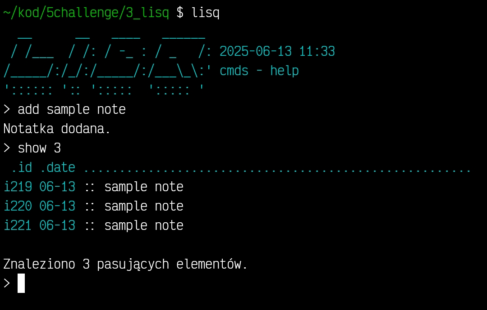

# Lisq

From Polish *"lisek / foxie"* – lisq is a **single file** note-taking app that work with `.txt` files.



*Code available under a non-commercial license (see LICENSE file).*

**Copyright © funnut**

## Instalation

`apt update && apt upgrade -y && cd && pkg install git -y && git clone https://github.com/funnut/Lisq.git && echo 'alias lisq="python3 ~/Lisq/lisq.py"' >> ~/.bashrc && cd Lisq && lisq h`

## Commands

```bash
quit, q, exit   # Exit the app  
clear, cls      # Clear the screen  

show, s         # Show recent notes (default 10)  
show [int]      # Show [integer] number of recent notes  
show [str]      # Show notes containing [string]  
show all        # Show all notes  
show random     # Show a random note  

del [str]       # Delete notes containing [string]  
del last, l     # Delete the last note  
del all         # Delete all notes  

reiterate       # Renumber notes' IDs  
path            # Show the path to the notes file  
edit            # Open the notes file in editor
```


## CLI Usage

```bash
lisq [command] [argument]
lisq :: sample note text
alias lisq="python3 /file/path/lisq.py"
```
